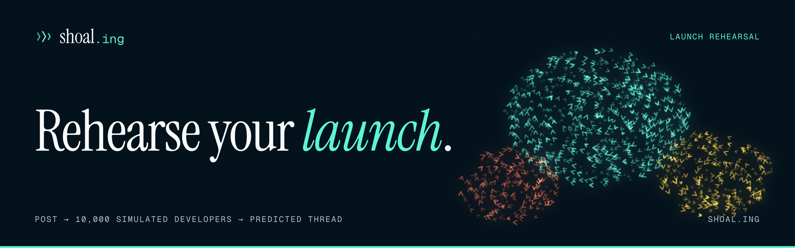

<p align="center">
  
</p>

<p align="center">
  
  
  
  
  
  
  
</p>

<p align="center">
  <b>shoal.ing</b> · a <a href="https://factory0.ventures">Factory Zero</a> venture · <a href="https://github.com/shoal-ing">github.com/shoal-ing</a>
</p>

---

# The site

The marketing site for **Shoal**, which rehearses a software launch before it
is posted: paste a launch post or README, and thousands of simulated developers
read it, vote on it and argue about it on a simulated Hacker News, Reddit or X.
You get the predicted thread, the top objections and the edits that change the
outcome. One page, one stylesheet and one script, served by Cloudflare as
static assets. No framework, no bundler, no build step and no runtime
dependency.

It was designed in Claude Design (`Shoal Landing.dc.html`, project
`37f28267-c933-44c3-8839-8c5f06e7cc5e`) and ported from its React template to
static HTML. The hero is a canvas: a boids shoal of chevron fish, ported from
the canvas's `makeShoal`. The design has no photo slots, so there are no
generated stills.

## The rule this site is built around

Shoal is in **early access**, and nothing is installable yet. So:

- Every call to action leads to the early-access form. The design's
  `curl -fsSL shoal.ing/install.sh | sh` copy buttons, its "Verify signature"
  panel and its `cargo install` / `brew install` line are gone: none of them
  exist yet. The final section says, once, that the install script is planned,
  cosign-signed and not published.
- Pricing is shown as **planned pricing**; nothing is billed. `llms.txt` and
  the JSON-LD say the same (`availability: PreOrder`).
- The "Try it" run is a **mock run** against a sample post, and says so. The
  hero's simulated comments are sample agent output.
- **Invent nothing.** The design's "Calibration" section (six fictional
  launches, an 11% median error, "5 / 6" objections matched) was marked as
  sample data with fictional launches. It is not on the page.

Claims are tracked in [`COPY.md`](COPY.md).

## The page

| Anchor | Section | Job |
| :--- | :--- | :--- |
| `#top` | Hero | The claim, the water (move to steer it, click to send a pulse), "Rehearse a launch" sorts the shoal into praise, question and objection schools while simulated comments surface and the headline counts to 412 points |
| `#run` | 01 · Try it | An editable sample post with a live word count, and a mock run: four stage cards, a terminal log printed line by line (Run rehearsal or Cmd/Ctrl+Enter), then the predicted points, top objection and suggested edit |
| `#how` | 02 · How it works | Seed, Simulate, Score, and the four parts of the one Rust binary |
| `#pricing` | 03 · Pricing | Four planned plans: Open source, Launch, Team, Enterprise |
| `#access` | Early access | "Hear the thread before it happens", the sign-up form, the footer |

Plus a dark/light toggle (the design's two palettes; remembered per visitor),
`404.html`, `llms.txt`, `sitemap.xml`, `robots.txt`, `site.webmanifest`,
`.well-known/security.txt` and an Open Graph card.

## How it moves

`assets/shoal.js` does four things: the hero water (a boids simulation on a
spatial grid, drawn to a canvas plus a blurred glow canvas), the swimming logo
mark, the mock run, and the sign-up form. The canvas reads its colours from the
CSS tokens, so `assets/shoal.css` is the one place the palette lives.

The HTML ships the finished mock run. With the script blocked
(`<html class="no-js">`) you see the whole log and the report, the controls
that would do nothing are hidden, the hero shows a still wash of the palette,
and the form falls back to a `mailto:`. With `prefers-reduced-motion` the water
is drawn once and holds still, the logo does not swim, and the mock run prints
at once.

## Layout

```
.
├── index.html                  the page
├── 404.html
├── assets/
│   ├── shoal.css               the whole design system, tokens at the top
│   ├── shoal.js                hero water, logo, mock run, theme, menu, sign-up
│   ├── favicon.svg             the mark: three chevron fish
│   ├── og.png                  Open Graph card
│   ├── apple-touch-icon.png  icon-512.png
│   ├── org-avatar.png          GitHub organization avatar, uploaded by hand
│   └── readme-banner.png       the banner above
├── tools/
│   ├── build-dist.sh           assembles dist/ from an allowlist, stamps cache hashes
│   ├── deploy.sh               deploys origin/main, and nothing else
│   ├── og-render.html          source for og.png
│   ├── banner-render.html      source for the README banner
│   ├── avatar-render.html      source for the org avatar
│   ├── shoal-field.js          the still shoal those three draw
│   └── render-og.sh            renders all of the above with headless Chrome
├── llms.txt  robots.txt  sitemap.xml  site.webmanifest  _headers  _redirects
├── wrangler.toml
└── COPY.md                     every factual claim, with its source
```

## Local preview

No build step, but the page uses root-relative paths, so serve it rather than
opening it as `file://`:

```sh
python3 -m http.server 8080
# then http://localhost:8080/
```

The sign-up form will not reach the waitlist from localhost, and says so with
the contact address.

## Regenerating images

```sh
./tools/render-og.sh
```

It writes `og.png`, `readme-banner.png`, `org-avatar.png`, `icon-512.png` and
`apple-touch-icon.png`. Copy the banner and avatar to `shoal-ing/.github`
afterwards. GitHub has no API for organization avatars, so upload
`assets/org-avatar.png` by hand at
`github.com/organizations/shoal-ing/settings/profile`.

## Deploy

A Cloudflare Worker with static assets, `shoal-website` (`wrangler.toml`), on
the Factory0 account. It has no script: Cloudflare serves `dist/` and applies
`_headers` and `_redirects`. It is on `shoal-website.<subdomain>.workers.dev`
(`workers_dev = true`) and on the custom domains `shoal.ing` and
`www.shoal.ing`, which the deploy attaches itself. Merge to `main`, then:

```sh
tools/deploy.sh              # deploy origin/main
tools/deploy.sh --dry-run    # build it and say what would ship
```

The script deploys **`origin/main` and nothing else**. It fetches, checks `main`
out into a throwaway worktree, builds there, deploys that, and removes it; the
deployment records the commit. It never reads your working copy or its `dist/`.
More than one agent session can work in one checkout at once, and deploying
from a working copy can publish another session's uncommitted edits or roll
back work merged minutes earlier. Do not run `wrangler deploy` by hand.

Edit in a worktree of your own, not in the shared checkout:

```sh
git worktree add ../shoal-website-worktrees/<name> -b <branch> origin/main
```

### Custom domains

> **State on 2026-10-03:** `shoal.ing` and `www.shoal.ing` are attached and live; the deploy attaches them itself.

The routes in `wrangler.toml` need the `shoal.ing` zone active on the Factory0
account. If it is not, wrangler refuses the deploy; to bring them up from
scratch:

1. Add `shoal.ing` as a zone on the Factory0 Cloudflare account.
2. Point the domain's nameservers (at the registrar, Spaceship) at the two
   Cloudflare nameservers the zone shows, and wait until the zone is active.
3. Make sure the two `[[routes]]` blocks in `wrangler.toml` are present
   (comment them out to deploy to workers.dev alone meanwhile).
4. `tools/deploy.sh`. Cloudflare creates the DNS records and certificates for
   the custom domains itself; do not add them by hand.

## The waitlist

The form posts `{ email, product: "shoal" }` to
`https://api.shoal.ing/v1/waitlist`, the same contract as the release.show,
Colonizer and PosPlugin waitlists: a Cloudflare Worker running
[Cratefield](https://cratefield.com)'s harness `waitlist` module with its own
D1 database. That worker is **live** (since 2026-10-03):
[`shoal-ing/waitlist-backend`](https://github.com/shoal-ing/waitlist-backend)
(private), Worker `shoal-waitlist` on the Factory0 account, D1 database
`shoal-waitlist`, custom domain `api.shoal.ing`. It allows the origins
`https://shoal.ing` and `https://www.shoal.ing`, accepts `product: "shoal"`
with no answers and no captcha, and answers a valid join with
`202 {"ok":true}`. Signups are read with `wrangler d1 execute` from that repo
(see its README). If the worker ever fails, the form says so and offers
`contact@shoal.ing` instead of pretending the address was saved.

No confirmation mail is sent, so the success copy says "we'll email you when
Shoal is ready to install", not "check your inbox". The `_headers` CSP already
allows `connect-src https://api.shoal.ing`.

## House rules for edits

1. **Invent nothing.** No metrics, user counts, calibration results,
   testimonials, customer logos or benchmarks. The design's calibration table
   and its numbers were sample data with fictional launches; they stay off the
   page until there are real rehearsals scored against real threads.
2. **Early access is the tense.** Nothing on the page offers a flow that does
   not exist yet: no install command to copy, no sign-in, no docs, status or
   changelog links until they exist.
3. **The demo says it is a demo.** "Try it" keeps the line "This is a mock run
   against the sample post below". Keep it.
4. **No price is charged.** Pricing stays labelled as planned until billing
   exists; keep `PreOrder` in the JSON-LD.
5. **No dark patterns.** No fake urgency, no "most used" badges, no
   pre-checked boxes, nothing gated behind an email.

---

<p align="center">
  <sub>No tracking cookies · Built by <a href="https://factory0.ventures">Factory Zero</a></sub>
</p>
